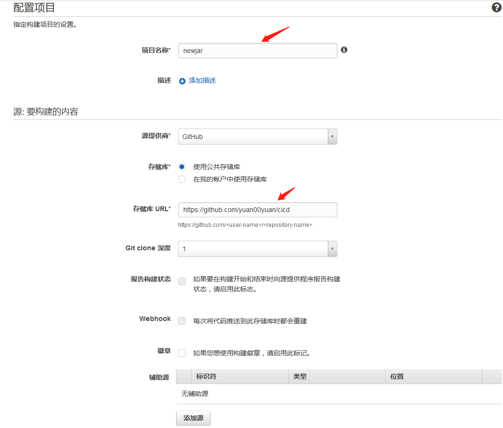
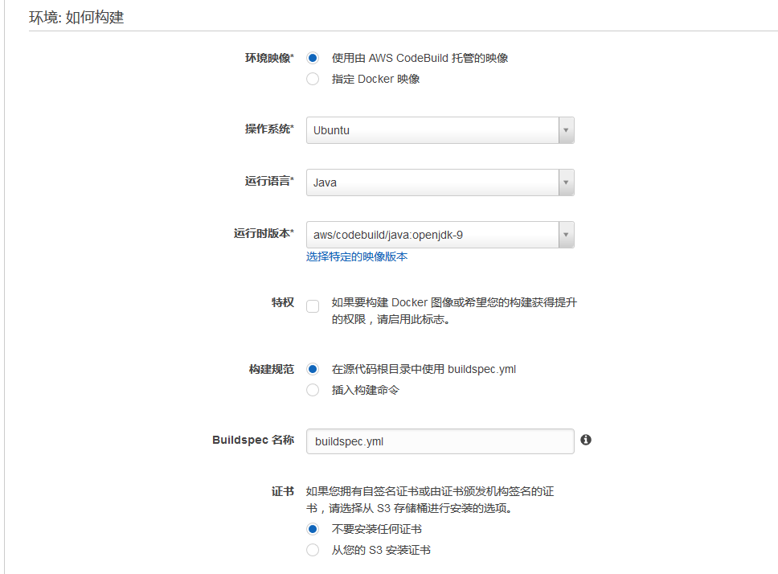
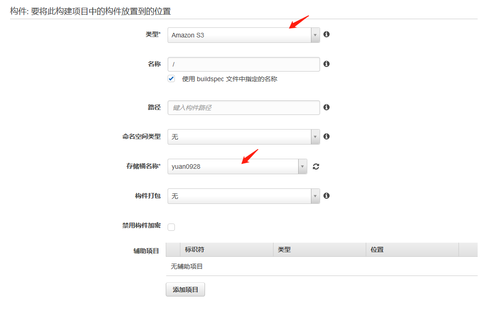
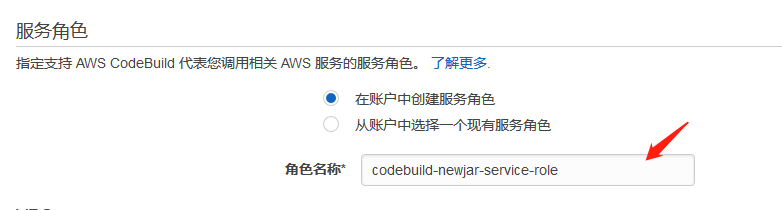
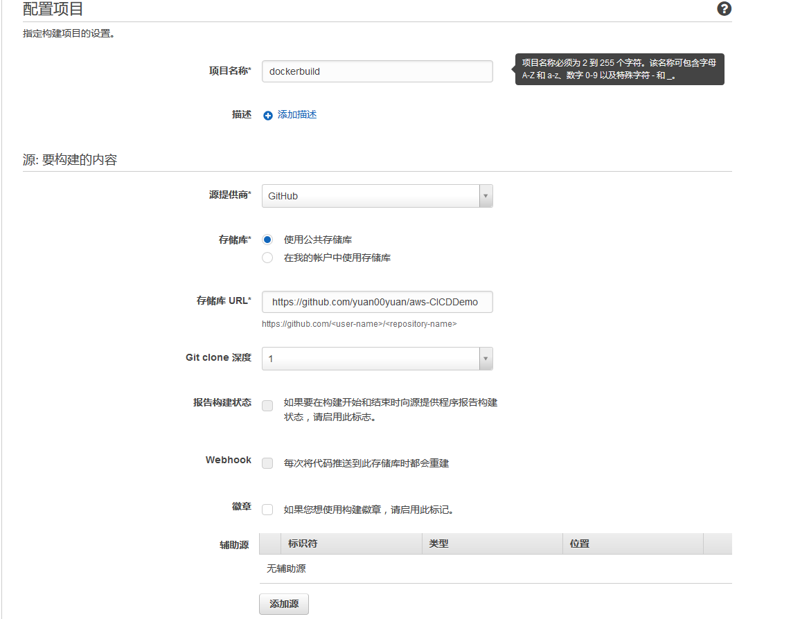
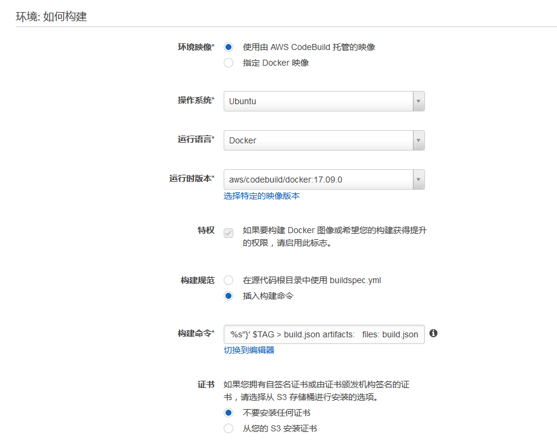
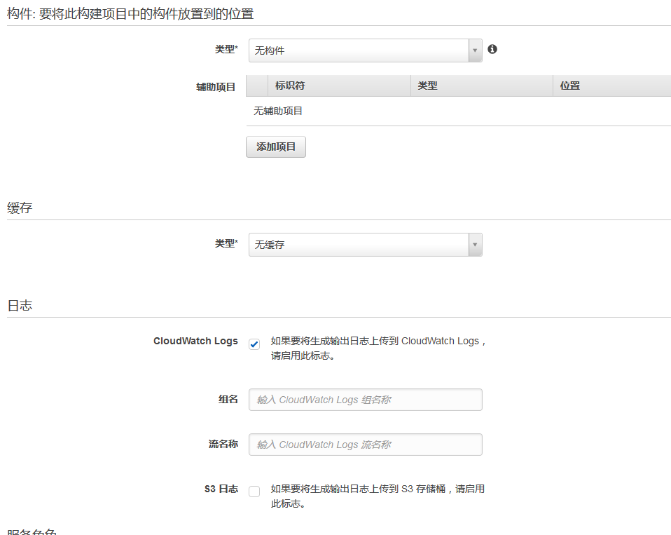
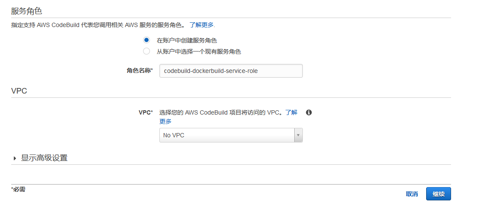

- ### 概述
本文描述了用jenkins做容器蓝绿部署的codeBuild的相关配置
- ### 组成
1. codebuild项目： 源码代码->jar包
2. codeBuild项目： jar包->docker镜像
- ### 创建codebuild项目： 源码代码->jar包
1. 此项目构建的目标为把java程序打包成jar包
2. 输入项目名称和源码存储的地方  如github  github项目url
  
3. 选择ubuntu为基本镜像
4. 选择Java环境和openjdk-java9的版本
5. 选择“buildspex.yml”作为构建脚本
  
6. 选择S3作为构建的输出
7. 输入作为输出的S3桶的名称
  
8. 选择codebuild的执行角色
  
- ###  创建新的codeBuild项目： jar包->docker镜像
1. 此项目的目标为将jar包构建为dockers镜像
2. 输入项目名称和源码存储的地方  如github  github项目url
  
3. 选择ubuntu为操作系统
4. 语言为dockers
5. 运行版本为aws codebuild docker
  
6.输入构建命令

```
version: 0.2
phases:
  pre_build:
    commands:
      - $(aws ecr get-login --no-include-email)
      - TAG=v_${BUILD_NUMBER}
      - echo $TAG
      - aws s3 cp s3://<输出构建的s3桶地址> /test_springboot.jar ./
  build:
    commands:
      - docker build -t <账号>.dkr.ecr.us-east-1.amazonaws.com/codevpcregis:$TAG .
  post_build:
    commands:
      - docker push "<账号>.dkr.ecr.us-east-1.amazonaws.com/codevpcregis:$TAG"
      - printf '{"tag":"%s"}' $TAG > build.json
artifacts:
  files: build.json

```
7. 选择无构建   无缓存
  
8.选择codeBuild的角色
  
9. 点击继续
