- ## 概述
本文描述了用jenkins完成java项目的CICD流程的CodeBuild,CodeDeploy所需步骤
- ## 组成
1. codebuild项目： 源码代码->jar包
2. CodeDeploy构建

- ### - CodeBuild构建
1. .点击“创建项目”
  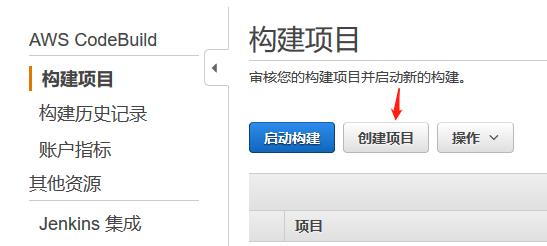
2. 进入如下页面，输入项目名称并连接到GitHub仓库
  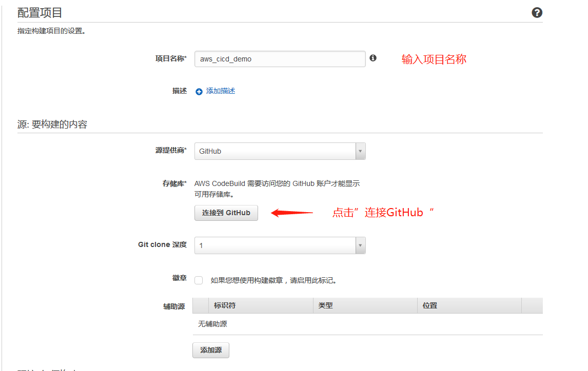
3. 点击进行授权许可 并填写源码所在的GitHub仓库
  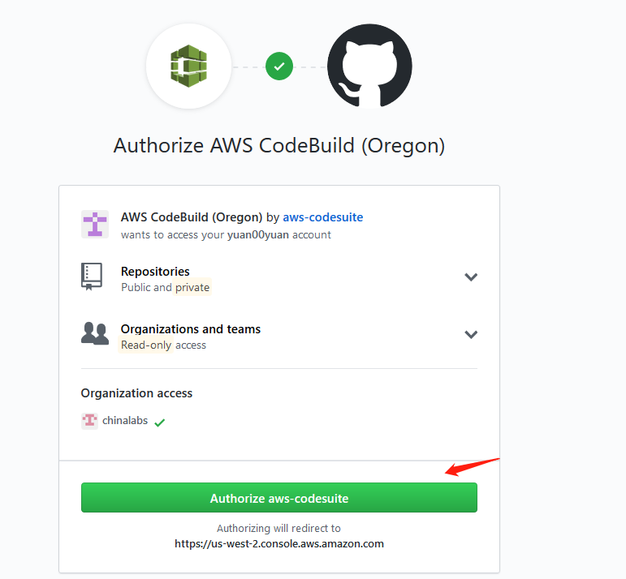
  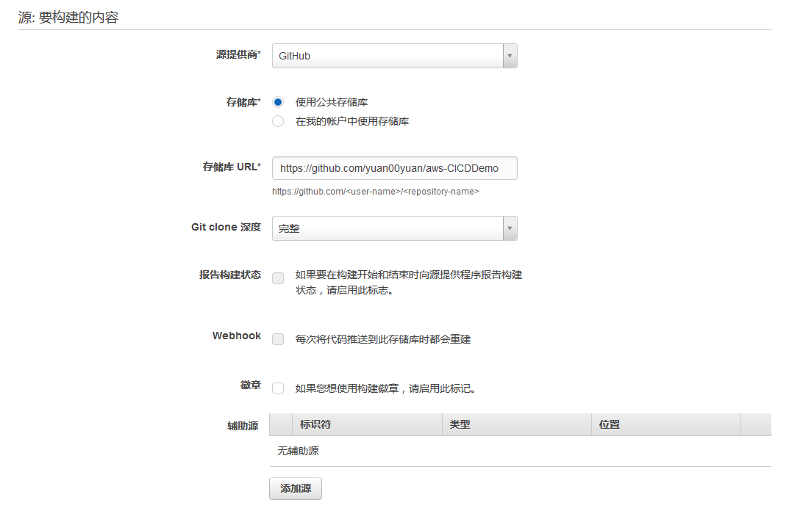
4. 选择构建环境，操作系统和语言，本例项目使用java编写
  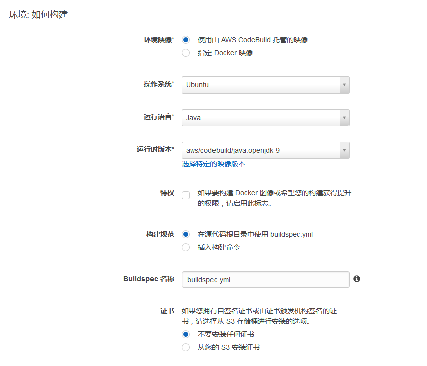
5. 构建是把构建的结果输出到指定的位置，如S3桶中，本例使用S3桶存储构建的结果
  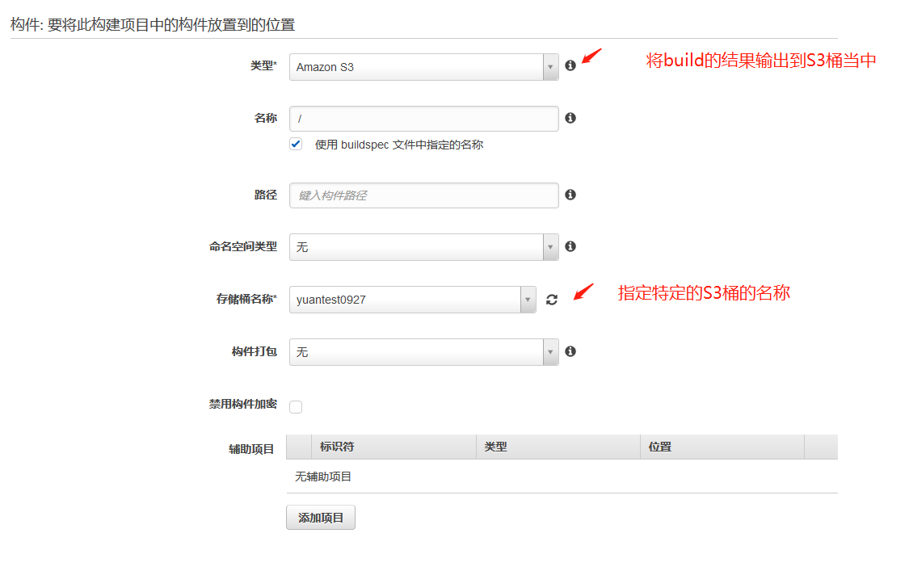
6. 创建一个新的角色 用于此codeBuild项目
  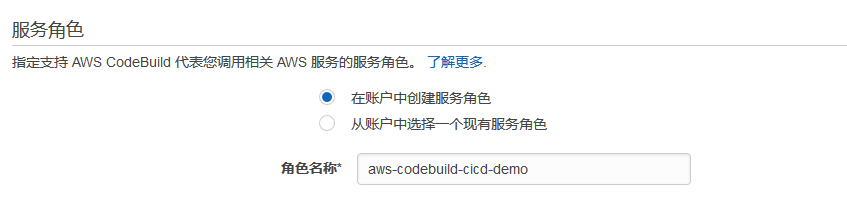
7. 其他项目保持默认  点击继续, 在review页面中点击保存
  
8. 点击启动构建
  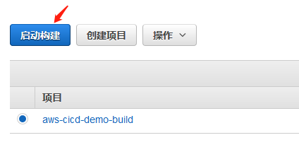
9. 点击 “左侧构建历史纪录” 可以看到构建成功是“success”
  
10. 在输出构建的s3桶中 可以看到构建的结果
  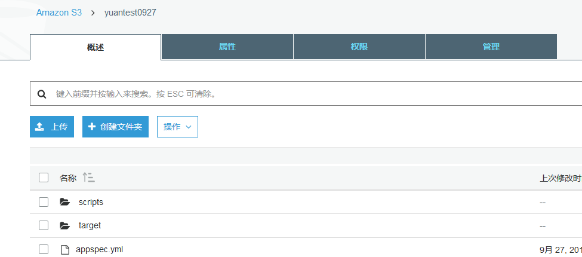
### - CodeDeploy构建
1. 点击“创建应用程序“
  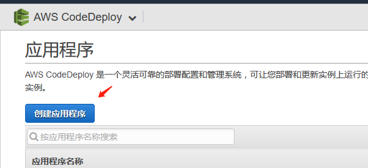
2. 输入“应用程序名称“和”部署组名称“
  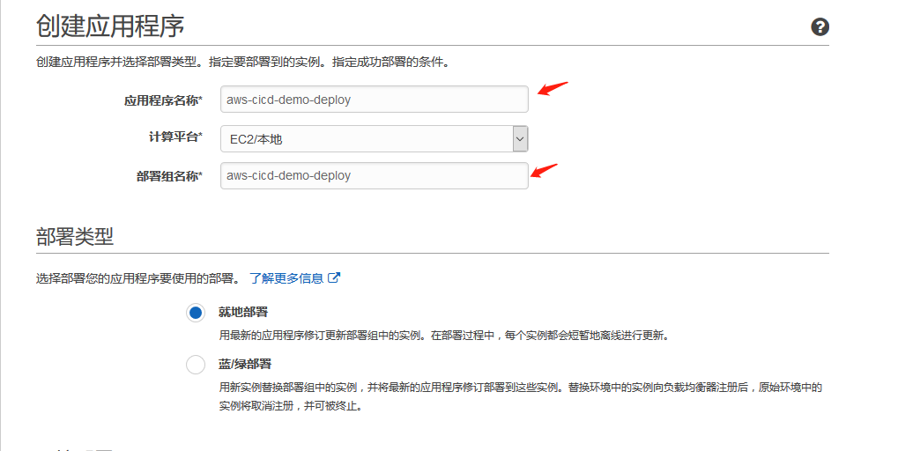
3. 选择相应的ec2实例，我们的应用程序将部署在这些ec2实例中
  
4. 点击部署配置  本例中选择”oneAtATime”
5. 在IAM中创建角色赋予code deploy的访问权限，选择服务的arn，点击“创建应用程序”
  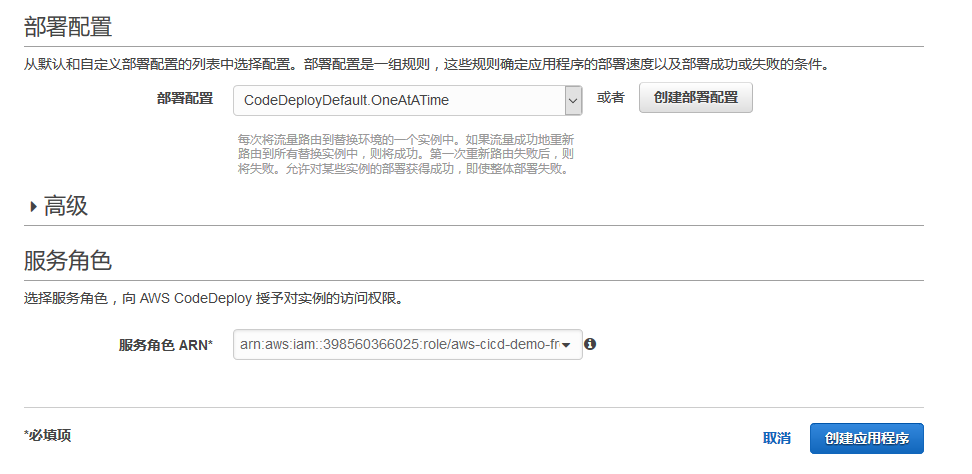
